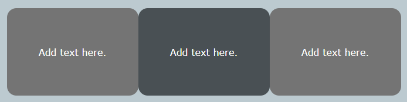

To make the corners of an element rounded, you can use the `rounded` class. 

--- code ---
---
language: html
filename: index.html
line_numbers: false
---

    
Add text here.

--- /code ---

**Tip:** You can adjust the `border-radius` of the `rounded` class in `style.css`.

--- code ---
---
language: CSS
filename: style.css
line_numbers: false
---

.rounded {
  border-radius: 1rem;
}

--- /code ---
