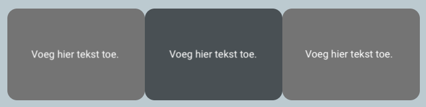

Je kunt de hoeken van een element afgerond maken met de 'rounded' class.

--- code ---
---
language: html
filename: index.html
line_numbers: false
---

    
Voeg hier tekst toe.

--- /code ---

**Tip:** Je kunt de `border-radius` van de class `rounded` aanpassen in `style.css`.

--- code ---
---
language: CSS
filename: style.css
line_numbers: false
---

.rounded {
  border-radius: 1rem;
}

--- /code ---
